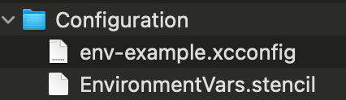

#  Flow for Mobile iOS SDK


- [Minimum Requirements](#minimum-requirements)
- [Integration](#integration)
  - [Swift Package Manager](#swift-package-manager)
- [Setting Up the Sample App](#setting-up-the-sample-app)
- [Changelog](#changelog)

## Minimum Requirements

- iOS 15
- Xcode 16
- Swift 6

## Integration

For detailed integration steps, refer to our 
<kbd>[official documentation](https://www.checkout.com/docs/payments/accept-payments/accept-a-payment-on-your-mobile-app)  ↗️ </kbd>. You can also explore our Sample Application for a practical implementation.

**🔐 3DS authentication can be enabled by setting it to `true` during `Configuration` initialization.**

```swift
 threeDS: .init(enabled: true, attemptN3D: true)
```

><samp>**attemptN3D** 
>You can choose to automatically downgrade your payment to a non-3DS payment if there are any technical issues during the 3DS authentication process that would otherwise cause the payment to fail. To do this, set the attemptN3D field in your request to true and we'll automatically attempt to process the payment without 3DS authentication <kbd>[More info](https://www.checkout.com/docs/payments/authenticate-payments) ↗️</kbd></samp>

### Swift Package Manager
<kbd>[Swift Package Manager](https://swift.org/package-manager/)  ↗️ </kbd> integrated with the Swift build system to automate the process of downloading, compiling, and linking dependencies. It should work out of the box on latest Xcode projects since Xcode 11 and has had a lot of community support, seeing huge adoption over the recent years. This is our preferred distribution method for Frames iOS and is the easiest one to integrate, keep updated and build around.

If you've never used it before, get started with Apple's step by step guide into <kbd>[adding package dependencies](https://developer.apple.com/documentation/xcode/adding-package-dependencies-to-your-app)  ↗️</kbd> to your app

## Setting Up the Sample App


Please use our Dashboard to create <kbd>[sandbox](https://identity-sandbox.checkout.com) ↗️ </kbd>/<kbd>[production](https://identity.checkout.com) ↗️ </kbd> values:
- processing_channel_id
- secret_key
- public_key

1. After cloning the repository, navigate to `SampleApplication/SampleApplication/Configuration`. You will find the following files:
    - **`env-example.xcconfig`**: A template file containing dummy environment variables, which is tracked in source control.
    - **`EnvironmentVars.stencil`**: A code generation template used by  <kbd>[Sourcery](https://github.com/krzysztofzablocki/Sourcery) ↗️ </kbd>

      

2. Open a terminal and navigate to the repository’s root folder:
   ```sh
   cd path/to/repository
   ```
3. Run the initialization script:
   ```sh
   bash .github/scripts/init-env-vars.sh
   ```
4. Locate the newly created `env.xcconfig` file (excluded from version control) and update it with your Checkout.com public and private keys.
5. Generate the required Swift environment variables:
   ```sh
   bash .github/scripts/codegen-env-vars.sh
   ```
6. This script will generate `EnvironmentVars.generated.swift`, which will be used in the project.

7. Open the Sample Application in Xcode and run it.

8. After completing the setup, your configuration files should resemble the structure shown below:

    

9. Set the `processingChannelID` value when creating a `PaymentSessionRequest` in the sample application.

>**⚠️ Important** <br>
> The secret key is embedded in the Sample Application **only** for demonstration purposes. Never include a secret key in your production application. Instead, always use your backend API to generate a payment session securely.

## Changelog

Find our <kbd>[CHANGELOG](./.github/CHANGELOG.md) ↗️</kbd>
